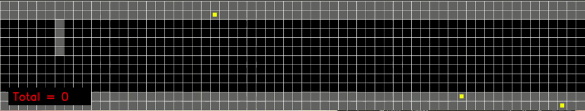

# CAV-MAS

**********************************************
Welcome to the Trustworthy Systems Lab github!
**********************************************

In this case study we explore the use of agency-directed test generation to generate accurate and realistic driving scenarios. The python script AgentBasedTestGen.py allows you to explore a straight road scene with pavements either side.

User-configurable parameters can be adjusted at line 1440 which are:

nTests =  the number of repeats
gridH, gridW = the height and width of the road in cells
vAV = speed of the AV in cells/sec (1 cell = 1.5m)
vPed = pedestrians speed in cells/sec
nA = number of agents
delay = delay between sim ticks to view progress (display_grid must be True)
vt = points for generating a successful test
AV_y = staring location for te AV
default_reward = living cost for the agents
pead_pen = penalty for being on the road

Please see the paper for details of the test generation strategies. The agent behaviour is changed through agentChoices[x] where x is:
0 for random
1 for constrained random
2 for prximity
3 for election

Example of the Random test generation with 10 agents:

Example of the Proximity agency-directed test generation with 10 agents:

If you wish to loop through a list of different agent numbers, as we did in our tests then set loopAgentList = True and the program will record data for the agent numbers in nAList which is set to [1,2,3,4,5,6,7,8,9,10,15,20]

The program will generate several logs for chacking random nuber generation, agents movement, scores per test, position and successful test logs.

The values of diag can be set True to give some diagnostics of what the agents are doing and general debugging.

To run use:

python AgentBasedTestGen.py
